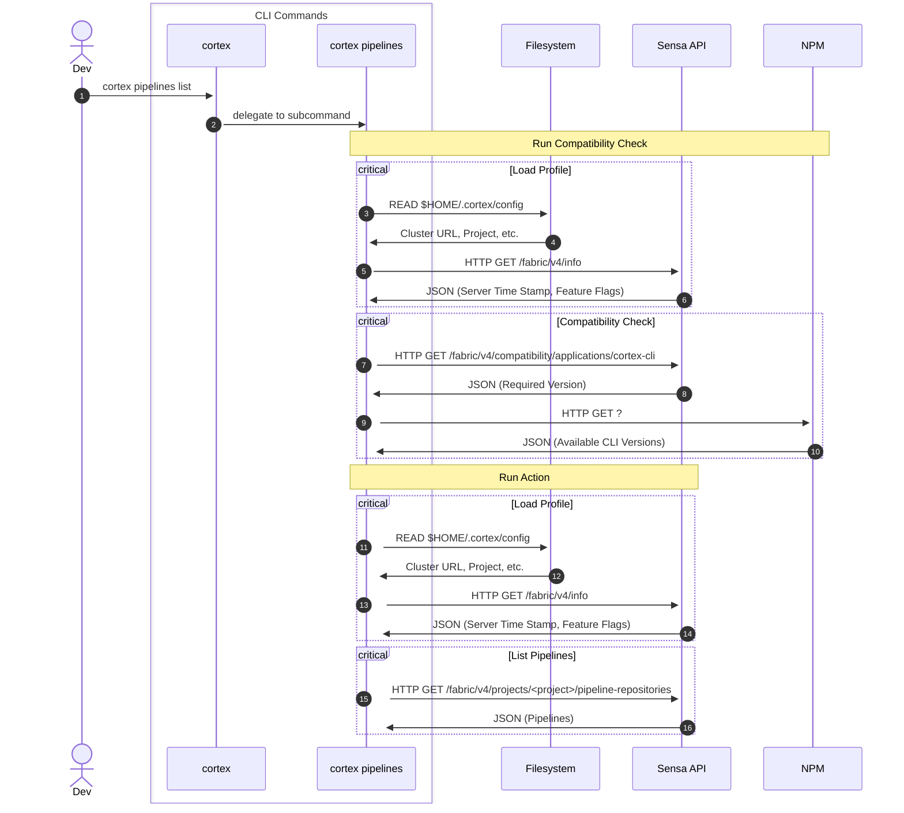
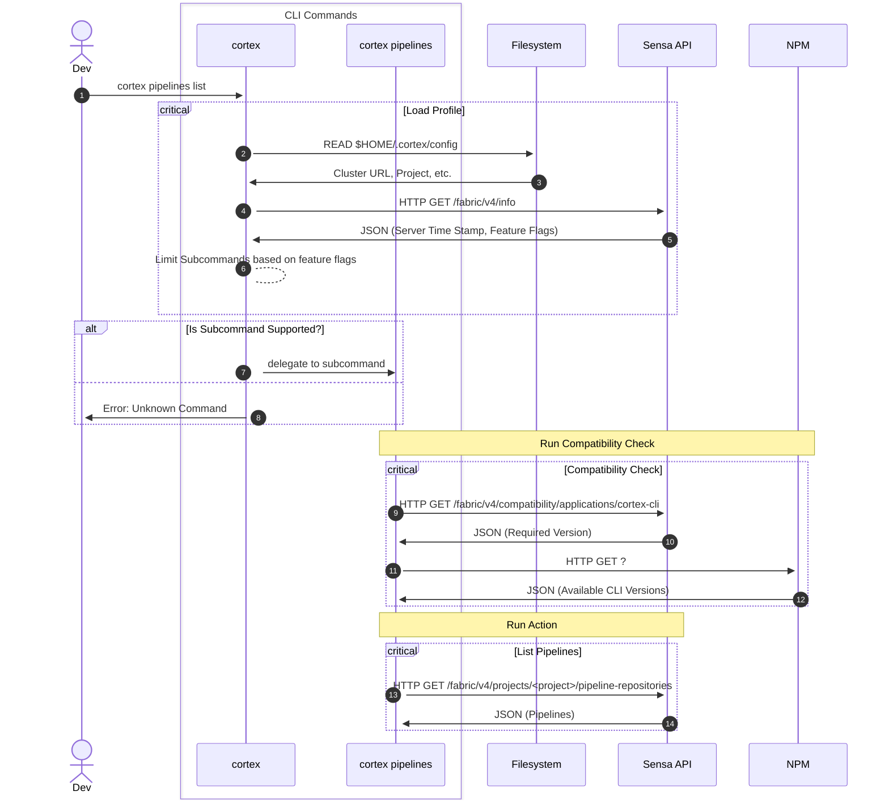

# Cortex CLI
A command line utility for the Cortex Platform.


[](http://travis-ci.org/CognitiveScale/cortex-cli)

### Installation:

#### From NPM:
```bash
npm install -g cortex-cli
```

#### From Source:
Once you have the code pulled, run this command from the cortex-cli directory:
```bash
npm install -g .
```

**NOTE:** When we have a release of this module, it will be published to npm.org for distribution.

#### For Developers:
You can link your local copy of cortex-cli to your globally installed version:
```bash
npm link
```

The cortex cli can be run directly from the source with a simple wrapper script
```
git clone https://github.com/CognitiveScale/cortex-cli.git
cat > /usr/local/bin/cortex <<EOM
#!/bin/bash
$PWD/cortex-cli/bin/cortex.js "\$@"
EOM
chmod +x /usr/local/bin/cortex
```


Changes you make to the source code will now be available immediately (locally).

### Usage:

```bash
cortex <command> [sub-command] [options]
```
### Common Options

- -h, --help
- -v, --version

### Getting Started
```bash
cortex configure --file /personal/access/token.json --project defaultProject

or

cortex configure --project defaultProject
Cortex Personal Access Token: <paste access token>
```

Upon successful login, a config file will be saved in your home directory with your authentication token for future use. (**NOTE:** currently, you will have to re-run the configure command when your token expires).

To see a list of agents:
```bash
cortex agents list
[
  {
    "title": "Movie Recommendation Agent",
    "description": "Makes personalized movie recommendations for users.",
    "createdAt": "2017-12-22T03:07:39.863Z",
    "updatedAt": "2017-12-22T03:12:32.159Z",
    "name": "tutorial/movie_recommendation"
  },
  {
    "title": "Trading Insights Agent",
    "description": "Agent to generate personalized insights for traders.",
    "createdAt": "2017-12-22T03:07:40.109Z",
    "updatedAt": "2017-12-22T03:07:40.201Z",
    "name": "default/trading-insights-agent"
  },
  {
    "title": "Client Complaints Agent",
    "description": "Agent to intercept and classify customer complaints early in the process before it even goes to internal audit.",
    "createdAt": "2017-12-22T03:07:41.287Z",
    "updatedAt": "2017-12-22T03:07:41.360Z",
    "name": "default/client-complaints-agent"
  }
]
```

To use a different profile:
```bash
cortex configure --profile myprofile
...
cortex agents list --profile myprofile
```

#### Filtering Results using the --json or --query option (DEPRECATION WARNING for --query)
Many of the commands support a __--json / --query__ option for filtering JSON responses.  Queries use JMESPath to filter JSON documents. The specification for JMESPath can be found here: http://jmespath.org/.  It is similar to the popular JQ tool and supported by Amazon AWS and some other notable services.

For example, if I want to select just the name and title from my previous output:
```bash
cortex agents list --json "[].{name: name, title: title}"
[
  {
    "name": "tutorial/movie_recommendation",
    "title": "Movie Recommendation Agent"
  },
  {
    "name": "default/trading-insights-agent",
    "title": "Trading Insights Agent"
  },
  {
    "name": "default/client-complaints-agent",
    "title": "Client Complaints Agent"
  }
]
```

## Standalone binary

We use caxa https://github.com/leafac/caxa to build standalone binaries.
Previously, we used `pkg` but it doesn't support ESM without transpilation as of 07/2023

Executables are created for the following platforms:
  - Linux 64bit intel
  - Windows 64bit intel
  - macOS 64 bit intel. 
  - macOS 64 bit M1/M2.

### Signed binaries status
* windows: binaries are currently **unsigned**
* macOS: adhoc signature using [ldid](https://github.com/xerub/ldid)

## Compatibility Checks

[Before](https://mermaid.live/view#pako:eNrlVMtu2zAQ_JWF0EODytGlJ6FwYch2k8JRDMvpSReKWjvbUCRLUkaMIP9eKpQfsZ3-QHkiubPDGS6XLxFXNUZpZPFPi5LjmNjasKaU4AdrnZJtU6EJ6xF3ysAYN6UMG5V6hmx2C5lqGiZrG3a7oZlxxEkz6SADZoEr4_D5MqBoqwMENGkUJLFnQ1nvjjvOmZJAu7UOm_NY0bEVKC2D0fz2PJ538Xx-t-P1jgbD4ZcsPZMAgqwLoMxDvNAUahS4Zg7BKbBtxYP3HVeufERt0HSu4jyFRSu7-9HMUUWC3BayR-RPAc0NeVVMwEyxGuZGrbytEPLpnaiDT081GY3h08393SS5DkoTruSK1iHjAO0S37RmovVrAw-LWdzR_0buYkDHr3d6-2OKFG6Wyzn8mCwhWbHKEE82XxOSK9Xj9pw_i_scPhdoOpNLahAKxxodwxSZaw3CVLC1vTqr3t7rh7cRtHwghR9nJUxr4ckcKWmTcBcDLuiy1oV_3GSwhl9orM-4OjGfH534vS_jCcVow0iwSuDbe-95Lph8X_4ilN_3jUf_xxWf-S6C-fu-_mexdRBuk2_9bJjsenJgUCtL_ieiPdWJ0v1JB0lRHDVoGka1_-xeuu0yco_YYBmlfloz81RGpXz1uO7XK7aSR6kzLcZRq2vf7f3HGDZf_wIhb7Bb):



Notes:
* The Users Profile is loaded twice (2 Info HTTP Reqeusts), once when doing the compatiblity check, and once when
    executing the command.

[Desired](https://mermaid.live/view#pako:eNp9VE1z2jAQ_Ss7nh6aAeJLT54OHcZAQ4c4TEx64iLLa6IiS6ok0zCZ_PdKlg0k0Ookad--_XgrvUZUlhglkcHfDQqKU0a2mtQbAW6RxkrR1AXqcJ5QKzVMcR-OhXyBdLmAVNY1EaUJt34poi2jTBFhIQVigEpt8eU6IG-KEwQUU8iZwI4NRRk25x5zxtEcjMX60pZ7rhyFITBZLS7tmbdnq_tgcbWMxuNBmlyEB86M3YgAo5o5AsJhKUkJKy0rl0Ewpd7_lFACj7PJFD7dPdzP4ttAGlMpKrYN-BO0C5zyxp00PD0uh576F1I7BLT0to_ehsgTuFuvV_B9toa4IoVmNN5_iZmoZEDlHd-P_CGDzznqvSNdsxoht6RWQ5gjsY1GmHOyNTc99ah1WrKatUrQTksoiMESpICqc6u825ko3YhwCwtz5um2Svmyy28nuX0FDpJAiRy3xCJYCebo07Fyg-9dBk6eBGZaS53Ak9gJ-Uf003aRSSYdrfRFu0jDzAnRtGBFLCsYZ_YA6TPS3YWmVzFtR5vC53298fTcKyZKcUdmmRQmDqqPKGdnyrTlB20e3Vtj2nX3J2rjPG76lELAQXYWsWti9oFisieMk4Jj-wA7nl7UfzYlD01xz9ihL2fbDTys3j-__7ZAhWE18dduN4775zPSqKRh7rtgR6oPJRwjnbKOhlGNuiasdD_Sq7_eRPYZa9xEiduWRO820Ua8OZz_mvKDoFFidYPDqFGlG6vu9wqXb38B-i2SbA):



Notes:
* We only want to load the Profile & perform a Compatibility Check once!
* The downside is that startup for help commands are slower!
