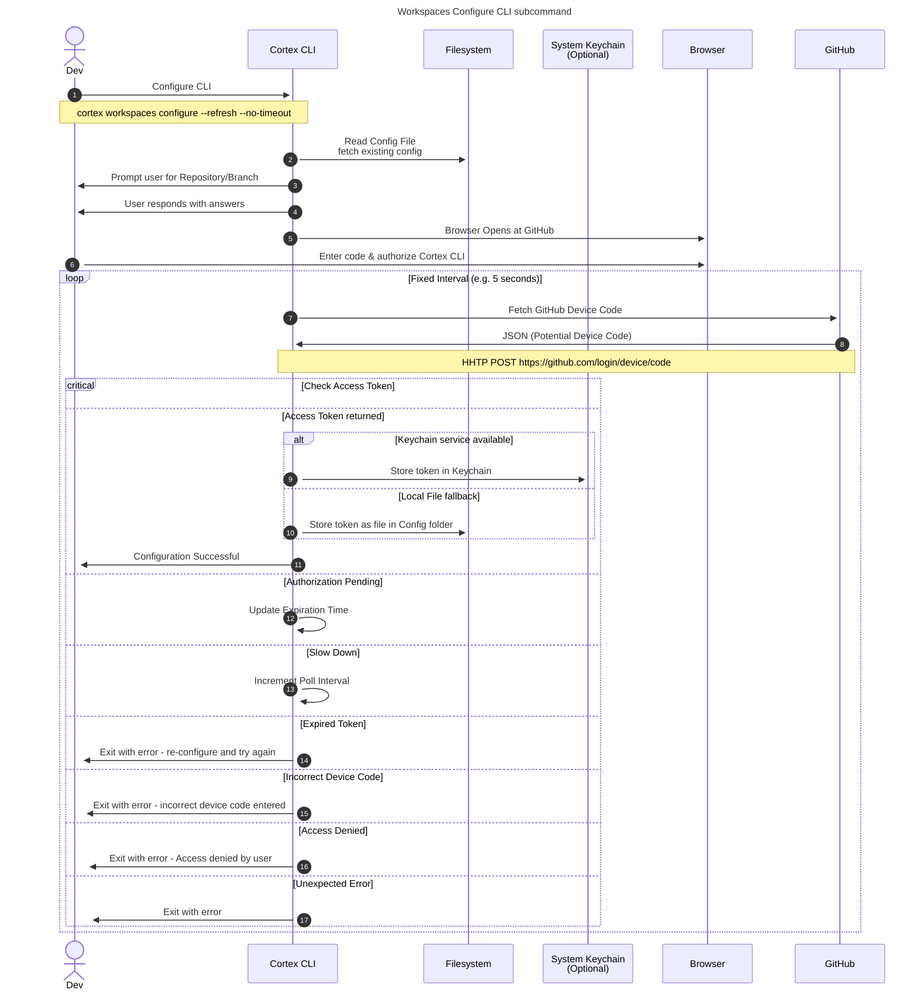
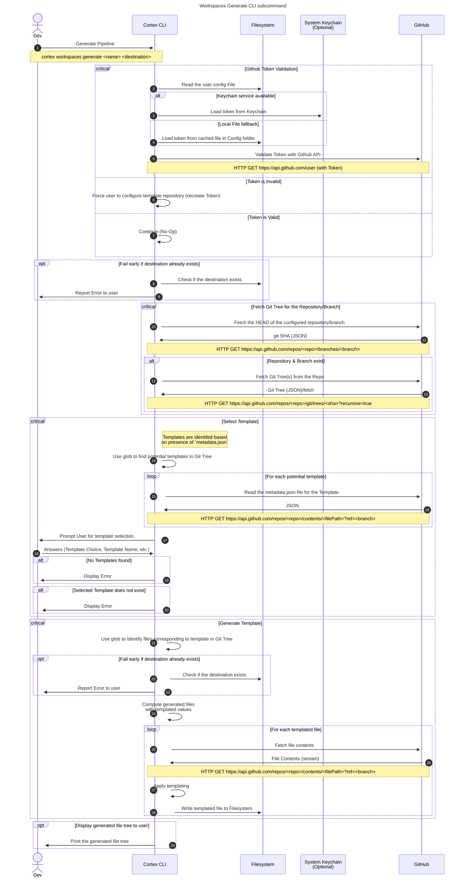

# Workspaces

## Overview

Note that `workspaces` CLI commands are narrowly focused on generating Skill templates. Ideally `workspaces` would encompass Pipeline as well, but the initial implementation for Pipelines uses its CLI commands (similar to `workspaces`).

Both commands only support Git Repositories hosted on GitHub!

### Templates

The primary repository with templates can be found at: <https://github.com/CognitiveScale/cortex-code-templates>

* A template is any folder within the git Repository that contains a `metadata.json` file.

    Expected structure for `metadata.json`:

    ```json
    {
        "name": "<template-name>",
        "title": "<template-title>",
        "description": "<template-description>",
        "tags": ["list", "of", "tags", "applied", "to", "template"],
        "enabled": true,
        "resourceType": "Skill" // e.g. "Pipeline"
    }
    ```

* Templates can be nested in any subfolder in the repository
* The templating process works via the [loadsh template](https://docs-lodash.com/v4/template/) util. Refer to that documentation for how variables are templated.

### Additional Reference

* [Example Cortex Development Workflow](https://drive.google.com/file/d/1tPyuqtNFz9JFtJuQE6HRxou_SLKIK8fO/view?usp=drive_link)
* [Relation to Skill Building](https://docs.google.com/presentation/d/1k4vJ7d5oGbvFaUezl5dBXHtKc-CZK8IAGlvIq-RpJrk/edit#slide=id.g12c69d77b32_0_42) (i.e. migration from traditional Skill Building)

## Workspaces Configure

The configuration process implements the [Github OAuth Device Flow](https://docs.github.com/en/apps/oauth-apps/building-oauth-apps/authorizing-oauth-apps#device-flow). The reason for implementing this flow is primarily to avoid rate limiting issues from the GitHub rest API, see:

* [Unauthenticated User Rate Limiting](https://docs.github.com/en/rest/using-the-rest-api/rate-limits-for-the-rest-api?apiVersion=2022-11-28#primary-rate-limit-for-unauthenticated-users) (~60 requests per hour)
* [Authenticated User Rate Limiting](https://docs.github.com/en/rest/using-the-rest-api/rate-limits-for-the-rest-api?apiVersion=2022-11-28#primary-rate-limit-for-authenticated-users) (~5000 requests per hour)

The GitHub authentication does NOT allow users to access private repositories. Using a private repository would require [registering the Cortex CLI App in your developer settings](https://github.com/orgs/community/discussions/48102).



<!--
TODO's:
- Work on pipeline template
- Export data for Pipeline template to local CSV
- Add example README
- Test that workspaces generate command still works
-->

## Workspaces Generate

The following diagram shows the sequence of steps taken when generating a template.



## Relation to Pipelines

The Cortex CLI offers similar capabilities for generating Pipelines template, similar to Workspaces, however, the both are distinct features (subcommands) in the CLI.

### Pipelines Configure

The process is simlilar to that of [workspaces configure](#workspaces-configure), but:

* A separate section of the Config file is used to store the Repository configuration - i.e. The Pipeline Template repository can be different

```bash
$ cortex pipelines configure --refresh --no-timeout
Configuring workspaces for profile qa-aks
? Template Repository URL:    CognitiveScale/cortex-code-templates
? Template Repository Branch: FAB-6046-pipeline-generate
Opening browser at https://github.com/login/device
Please enter the following code to authorize the Cortex CLI: FB05-0378   ( Expires in 14 minutes and 58 seconds ) - CTRL-C to abort
Github token configuration successful.
```

### Pipelines Generate

The process is simlilar to that of [workspaces generate](#workspaces-generate), but only Pipeline templates are available.

```bash
$ cortex pipelines generate
```

## Workspaces vs Pipelines

The Cortex CLI offers similar capabilities for generating Pipelines template, similar to Workspaces, however, the both are distinct features (subcommands) in the CLI.
